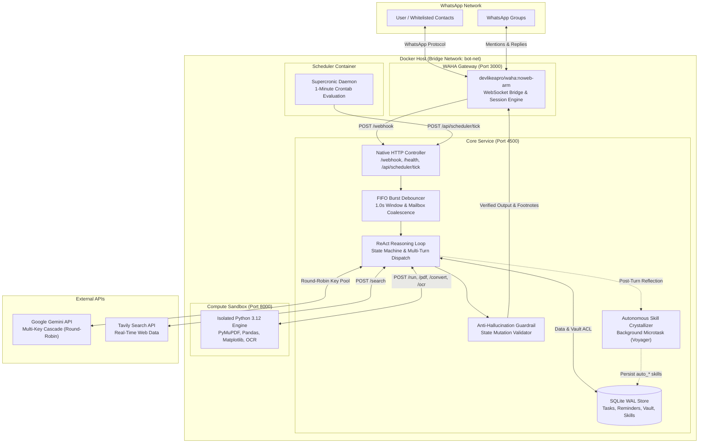

# John Mustard

Autonomous Executive AI Assistant for WhatsApp built on Node.js, WAHA, Google Gemini, and isolated compute sandboxes.

---

## Overview

John Mustard is a private, self-hosted executive assistant for WhatsApp engineered with a zero-dependency deep module architecture. It combines multi-step agentic reasoning, sandboxed code execution, document processing, and local database persistence to handle daily task tracking, scheduling, information retrieval, and document management.

The system is designed around autonomous ReAct execution loops with strict safety guardrails, deterministic offline command fallbacks, and multi-key API failover.

---

## System Architecture

The infrastructure runs inside an isolated Docker bridge network (`bot-net`). All inbound WhatsApp events pass through WAHA (WhatsApp HTTP API), enter a burst debouncer, and are processed by the core engine before any external LLM or tool interaction occurs.



---

## Project Structure

```
john-mustard/
├── config/
│   └── system-prompt.md            # Single source of truth system instructions
├── docs/
│   ├── INDEX.md                    # Technical documentation index
│   ├── ARCHITECTURE.md             # Enterprise system topology and interface seams
│   └── ADR/
│       └── 001-zero-dependency-deep-modules.md # Architectural decision record
├── runner/                         # Sandboxed compute environment
│   ├── Dockerfile                  # Python 3.12, PyMuPDF, and OCR container definition
│   └── server.py                   # Isolated execution endpoints (/run, /pdf, /convert, /ocr)
├── scheduler/                      # Proactive triggers
│   ├── Dockerfile                  # Alpine Supercronic container definition
│   └── crontab                     # 1-minute crontab schedule
├── scripts/                        # Diagnostics and audit utilities
│   ├── test_runner.py              # Python runner integration tests
│   └── audit.js                    # Database integrity and usage audit CLI
├── src/                            # Core application deep modules
│   ├── index.js                    # Bootstrap runtime and orchestrator entry point
│   ├── server.js                   # HTTP controller and FastMCP SSE controller
│   ├── llm.js                      # ReAct agent loop, tool dispatch, and guardrails
│   ├── db.js                       # SQLite WAL storage, vector similarity, and task repository
│   ├── queue.js                    # Inbound FIFO queue with burst debouncing
│   ├── rotator.js                  # Multi-key fault tolerance and rate-limit recovery
│   ├── crystallize.js              # Autonomous skill crystallization engine (Voyager pattern)
│   ├── skills_sync.js              # Two-way sync between SQLite skills and filesystem markdown
│   ├── vault.js                    # Document vault ingestion and Gemini Vision metadata indexing
│   ├── commands.js                 # Deterministic offline command parser and executor
│   ├── minecraft.js                # Server status query utility
│   └── waha.js                     # WhatsApp API client, media decoder, and message dispatcher
├── Dockerfile                      # Production Node.js 22 container definition
├── docker-compose.yml              # Multi-container orchestration specification
└── package.json                    # Project metadata and test scripts
```

---

## Core Modules and Subsystems

### 1. Agent Core (`src/llm.js`, `src/rotator.js`)
- **ReAct Multi-Turn Engine**: Orchestrates iterative tool selection, parameter extraction, and execution up to 5 steps per turn.
- **Multi-Key Rotator**: Distributes requests across a pool of Gemini API keys with round-robin load balancing and temporary backoff on HTTP 429 rate limits.
- **Two-Model Cascade**: Attempts requests using the primary high-speed model (`gemini-3.5-flash-lite`) and automatically degrades to the fallback model (`gemini-3-flash-preview`) upon failure.
- **Anti-Hallucination Guardrail**: Intercepts unexecuted claims of data mutations (e.g., claiming a task was added without executing `addTodo`) and forces correct tool dispatch.
- **Transparent Footnote Badges**: Appends executed tool signatures to final responses (e.g., `↳ searchWeb  ↳ executePython`).

### 2. Isolated Compute Runner (`runner/server.py`)
- **Resource Sandboxing**: CPU (0.5 cores) and memory (256 MB) constrained container isolated from bot credentials and the database file.
- **Arbitrary Python Evaluation (`POST /run`)**: Evaluates computational routines with support for Pandas, NumPy, and Matplotlib chart generation.
- **Polymorphic Document Processing (`POST /pdf`)**: PyMuPDF-backed PDF operations including merging, splitting, lossless compression, image conversion, and direct page-to-image rendering for WhatsApp preview.
- **Document Conversion & OCR (`POST /convert`, `POST /ocr`)**: Formats office documents and extracts textual layers from rasterized media.

### 3. Procedural Memory (`src/crystallize.js`, `src/skills_sync.js`)
- **Voyager-Style Crystallization**: Post-turn asynchronous reflection evaluates multi-tool workflows, complex computation, and user instructions.
- **Autonomous Playbook Synthesis**: Distills reusable procedures into structured Markdown skills stored in SQLite and synchronized with `skills/`.
- **Zero-Latency Invariant**: Background evaluation executes via `queueMicrotask` after the WhatsApp response has already been dispatched.

### 4. Storage and Access Control (`src/db.js`, `src/vault.js`)
- **SQLite WAL Mode**: Single-file storage engine with write-ahead logging for high concurrency.
- **Task Repository**: Automatic segregation of routine tasks (academic attendance, repetitive check-ins) from project deadlines.
- **Document Vault ACL**: Granular file ownership model with explicit permission grants (`file_permissions`) and inter-contact access request workflows (`file_requests`).
- **Vector Cosine Similarity**: Native cosine ranking over pre-computed document embeddings.

### 5. Communication Gateway (`src/waha.js`, `src/queue.js`)
- **Burst Debouncing**: Consolidates consecutive messages sent within a 1.0-second window into a single unified prompt.
- **Mid-Turn Mailbox**: Dynamically injects user corrections arriving while an LLM turn is actively generating.
- **Multi-Bubble Delivery**: Formats long responses with newline `---` markers into sequential WhatsApp bubbles with human-like typing delays.
- **Group Isolation**: Restricts processing in WhatsApp group chats to explicit `@mentions` or direct replies to the bot.

---

## Deterministic Fast Commands

When offline, low on LLM quota, or requiring immediate execution without AI latency, the bot provides deterministic command shortcuts:

| Command | Arguments | Description |
|---|---|---|
| `#ping` | None | Returns latency and system status |
| `#todo` | `[query]` | Lists active tasks |
| `#today` | None | Lists tasks due today |
| `#week` | None | Lists tasks due in the upcoming 7 days |
| `#<id>` | None | Displays detailed information for a specific task |
| `#done` | `<id>` | Marks a task as completed |
| `#undo` | `<id>` | Restores a completed task to pending |
| `#del` | `<id>` | Deletes a task from the database |
| `#add` | `<task text>` | Immediately records a new pending task |
| `#daily` | None | Lists routine and recurring responsibilities |
| `#skills` | None | Displays active procedural skills |
| `#reminders` | None | Lists pending scheduled reminders |
| `#contacts` | None | Displays known contact directory and relationships |
| `#health` | None | Outputs host CPU, memory, and container status (Owner only) |

---

## Getting Started

### Prerequisites

- Node.js >= 20.x
- Docker and Docker Compose
- Python >= 3.12 (for local test runner)

### Environment Configuration

Create your `.env` configuration from the sample:

```bash
cp .env.example .env
```

Set the required environment parameters:

```ini
PORT=4500
ALLOWED_PHONE=6281234567890,6289876543210
OWNER_PHONE=6281234567890
PRIMARY_USER_NAME=Owner
PRIMARY_USER_PHONE=6281234567890
SECONDARY_USER_NAME=Partner
SECONDARY_USER_PHONE=6289876543210
WAHA_URL=http://waha:3000

# WAHA Authentication
WAHA_DASHBOARD_USERNAME=admin
WAHA_DASHBOARD_PASSWORD=your_secure_password
WHATSAPP_SWAGGER_USERNAME=admin
WHATSAPP_SWAGGER_PASSWORD=your_secure_password
WAHA_API_KEY=your_secure_api_key

# Google Gemini API Keys (Comma-separated pool)
GEMINI_KEYS=AIzaSy...1,AIzaSy...2,AIzaSy...3

# Web Search
TAVILY_API_KEY=tvly-...
```

### Production Deployment

Start all services using Docker Compose:

```bash
docker compose up -d --build
```

Verify service status:

```bash
docker compose ps
```

Access the WAHA dashboard at `http://localhost:3000` to scan the WhatsApp QR code and start the session.

### Local Development

To develop and test modules directly on the host machine:

```bash
npm install
npm test
npm start
```

---

## Testing and Quality Assurance

Run the test suite across all deep modules (LLM, Database, Queue, KeyRotator, FastMCP, and PyMuPDF Runner):

```bash
npm test
```

Perform an audit on message interaction volume, tool usage frequency, and error trends:

```bash
npm run audit
```

---

## Documentation

Comprehensive architectural blueprints and design specifications:

- [System Topology and Domain Seams](docs/ARCHITECTURE.md)
- [Technical Documentation Index](docs/INDEX.md)
- [ADR 001: Zero-Dependency Deep Modules Pattern](docs/ADR/001-zero-dependency-deep-modules.md)
