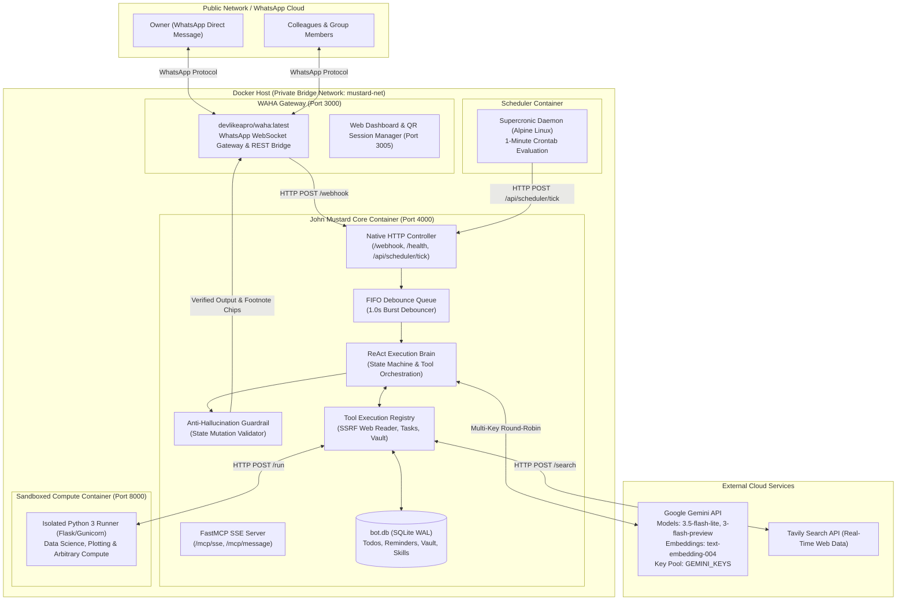
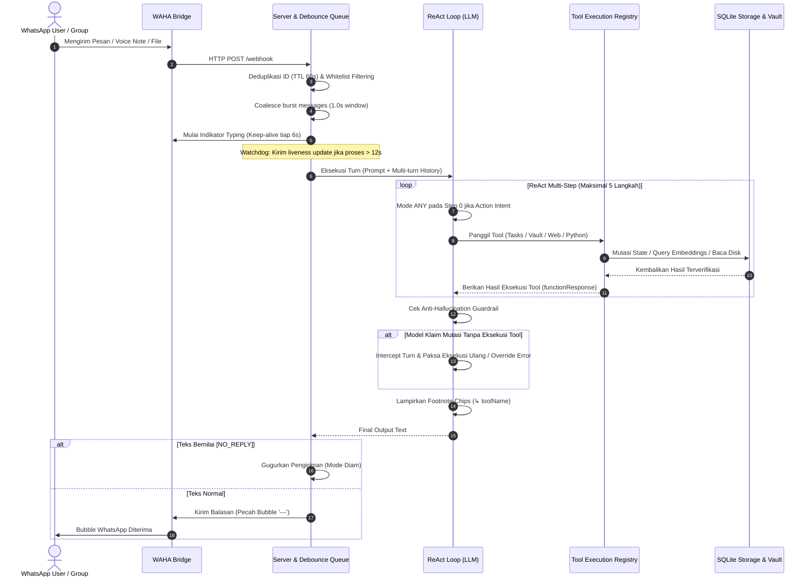

# John Mustard — Enterprise System Architecture & Design Specification

Dokumen ini mendokumentasikan spesifikasi arsitektur teknis dari **John Mustard** (Autonomous AI Executive Assistant for WhatsApp) mengikuti standar arsitektur level enterprise: **Deep Modules**, **Seam Discipline**, **Hexagonal Domain Boundaries**, dan **Zero-Dependency Core**.

---

## 1. System Topology & Container Orchestration

John Mustard dirancang untuk beroperasi secara mandiri dan aman 24/7 di private infrastructure (VPS / Dedicated Server) terisolasi di dalam Docker Bridge Network.



---

## 2. Domain-Driven Package Layout & Seams

Arsitektur kode memisahkan tanggung jawab menjadi domain yang memiliki antarmuka ramping (*deep modules*) dengan kompleksitas tinggi terenkapsulasi di dalamnya.

```
john-mustard/
├── config/
│   └── system-prompt.md            # Single Source of Truth System Prompt (Externalized)
├── docs/
│   ├── INDEX.md                    # Master Documentation Catalog
│   ├── ARCHITECTURE.md             # Enterprise System Architecture (Dokumen ini)
│   └── ADR/                        # Architecture Decision Records
├── src/                            # Core Application Modules
│   ├── index.js                    # Bootstrap runtime & orchestrator entry point
│   ├── server.js                   # HTTP Webhook Server & FastMCP SSE Controller
│   ├── llm.js                      # Agent Core: ReAct loop, Multi-Key Cascade, Guardrails, SSRF Reader
│   ├── crystallize.js              # Autonomous Skill Crystallizer & Background Reflection Engine (Voyager Pattern)
│   ├── db.js                       # Storage Engine: SQLite WAL, Vector Index, Task Repo, Vault ACL
│   ├── scheduler.js                # Proactive Engine: Recurrence calculation & Autonomous Action Runner
│   ├── queue.js                    # Inbound FIFO queue with burst debouncer (1.0s window)
│   ├── rotator.js                  # Multi-key fault tolerance, backoff & 24h blacklist manager
│   ├── vault.js                    # Document Vault ingestion & Gemini Vision OCR pipeline
│   └── waha.js                     # WhatsApp API client, Multi-bubble dispatcher, Watchdog
├── runner/                         # Sandboxed Universal Execution Engine
│   ├── server.py                   # Isolated Python computation & Matplotlib chart generator
│   └── Dockerfile                  # Python sandbox container definition
├── scheduler/                      # Proactive Container Trigger
│   ├── crontab                     # Supercronic crontab specification (* * * * *)
│   └── Dockerfile                  # Alpine Supercronic container
├── scripts/                        # Diagnostics, Quality Assurance & Test Runners
│   ├── test_runner.py              # E2E integration runner
│   └── audit.js                    # Database integrity and usage audit CLI
├── Dockerfile                      # Production Core Node.js 22+ container
└── docker-compose.yml              # Production container orchestration
```

---

## 3. Deep Module Seams & Interface Contracts

Sesuai filosofi **Deep Modules** (*a lot of behaviour behind a small interface*):

### 3.1. Agent Core (`src/llm.js`)
* **Seam (Interface)**:
  ```typescript
  processChat(
    rotator: KeyRotator,
    userText: string,
    options: {
      store: Storage,
      chatId: string,
      onToolCall?: (name: string) => void,
      audio?: { buffer: Buffer, mimetype: string, filename: string }
    }
  ): Promise<string>
  ```
* **Invariants**:
  1. *Anti-Promissory Guardrail*: Model dilarang keras mengklaim mutasi data (tambah/ubah/hapus/simpan) tanpa memanggil tool terkait (`detectUnexecutedMutationClaim`). Jika dilanggar, turn di-intercept dan dipaksa eksekusi tool.
  2. *Two-Model Fallback Cascade*: Transisi otomatis `DEFAULT_MODEL` $\to$ `FALLBACK_MODEL` $\to$ Mode `AUTO` saat mode `ANY` mengalami kegagalan.
  3. *Transparent Footnote Badges*: Jawaban yang mengeksekusi tool otomatis menyertakan badge transparansi di akhir pesan (misal `↳ searchWeb  ↳ executePython`).

### 3.2. Storage & Memory Seam (`src/db.js`)
* **Seam (Interface)**:
  ```typescript
  class Storage {
    constructor(dbPath?: string);
    addTodo(chatId, task, deadline?, tag?, category?): number;
    getTodos(chatId, includeRoutine?: boolean): Todo[];
    updateTodo(id, chatId, updates): number;
    deleteTodo(id, chatId): number;
    addReminder(chatId, message, timestamp, recurrence?, taskType?): number;
    getPendingReminders(now?: number): Reminder[];
    advanceRecurringReminder(id, recurrence): number;
    saveVaultFile(fileMeta): number;
    searchVaultFiles(query, category?, userId?, queryEmbedding?): VaultFile[];
    hasFileAccess(fileId, userId): boolean;
    grantFileAccess(fileId, targetUserId): number;
  }
  ```
* **Invariants**:
  1. *Routine Task Segregation*: Absensi, kuliah, dan presensi otomatis masuk kategori `routine` dan difilter dari tampilan default `listTodos` agar tidak menenggelamkan deadline penting.
  2. *Recurrence Invariant*: Pengingat berulang (`daily`, `weekly`) otomatis memajukan timestamp ke slot berikutnya (`advanceRecurringReminder`) alih-alih ditandai `sent`.
  3. *Multi-User File ACL*: Dokumen di dalam vault memiliki kepemilikan ketat (`owner_id`); pihak ketiga hanya dapat mencari atau menerima file jika telah diberikan izin eksplisit (`file_permissions`).

### 3.3. Communication & Channel Gateway (`src/waha.js`, `src/queue.js`)
* **Seam (Interface)**:
  ```typescript
  createDebounceQueue(handler: (msg) => Promise<void>, delayMs?: number): (msg) => void;
  sendText(chatId: string, text: string, replyTo?: string): Promise<any>;
  sendFile(chatId: string, filepath: string, filename: string, caption?: string): Promise<any>;
  ```
* **Invariants**:
  1. *Burst Coalescence*: Pesan bertubi-tubi dalam jeda $< 1.0$ detik digabungkan menjadi satu pesan utuh sebelum masuk ke LLM ReAct loop.
  2. *Multi-Bubble Splitting*: Simbol `---` di baris tersendiri memisahkan jawaban menjadi bubble pesan WhatsApp berbeda dengan typing delay natural (600ms).
  3. *Non-Intervention Protocol*: Pesan yang diawali atau bernilai `[NO_REPLY]` otomatis dibatalkan pengirimannya (menjaga etika bot di grup WhatsApp).

### 3.4. Procedural Memory & Autonomous Crystallization (`src/crystallize.js`)
* **Seam (Interface)**:
  ```typescript
  shouldAttemptCrystallization(executedTools: any[], userMessage: string): boolean;
  autoCrystallizeTurn(options: {
    senderName: string,
    userMessage: string,
    executedTools: any[],
    finalReply: string,
    store: Storage,
    rotator: KeyRotator
  }): Promise<Skill | null>;
  ```
* **Invariants**:
  1. *Zero-Latency Fire-and-Forget*: Refleksi background dijalankan via `queueMicrotask` setelah pesan WhatsApp terkirim ke pengguna, menjamin latensi respon user tetap 0ms tambahan.
  2. *Fast Heuristic Pre-Filter*: Turn casual atau trivial dibuang sebelum LLM critic dipanggil; hanya workflow $\ge 2$ tool non-trivial, komputasi Python kompleks (> 40 karakter), atau kalimat pengajaran eksplisit yang dievaluasi.
  3. *Autonomous Playbook Synthesis*: Skill yang lolos kurasi otomatis disimpan dengan prefix `auto_` ke tabel SQLite `skills` dan diinjeksikan dinamis ke system prompt giliran mendatang.

---

## 4. End-to-End Turn Execution Lifecycle



---

## 5. Security Architecture & Threat Mitigation

| Vektor Ancaman | Mekanisme Pertahanan di John Mustard | Lokasi Implementasi |
|---|---|---|
| **SSRF (Server-Side Request Forgery)** | Validasi ketat `isSafeUrl`: blokir alamat loopback (`127.0.0.0/8`, `localhost`), IP privat (`10.0.0.0/8`, `172.16.0.0/12`, `192.168.0.0/16`), Cloud Metadata (`169.254.169.254`), dan IPv6 internal. | `src/llm.js` (`isSafeUrl`) |
| **Pencurian Dokumen / Unauthorized Access** | RBAC dan File ACL di SQLite (`file_permissions`, `file_requests`). Hanya pemilik terdaftar yang dapat membagikan dokumen ke nomor lain. | `src/db.js` (`hasFileAccess`) |
| **Arbitrary Code Execution Exploit** | Eksekusi Python dipisahkan ke container Docker terpisah (`runner/`) dengan network isolation dan timeout execution (15s). | `runner/server.py` |
| **API Key Rate Limiting & Outage** | `KeyRotator` dengan dynamic round-robin, cooldown 60 detik pada `429/503`, dan blacklist 24 jam pada `403`. | `src/rotator.js` |
| **WhatsApp Spam & Flood** | Whitelist filtering berbasis nomor telepon E.164 + resolusi WhatsApp LID. | `src/waha.js` (`parseIncoming`) |

---

## 6. Proactive Automation & Recurrence Engine

Mesin pengingat beroperasi dengan toleransi waktu rendah:
1. **Cron Evaluation**: Trigger berkala tiap 1 menit via kontainer `scheduler` (Supercronic) memanggil endpoint `/api/scheduler/tick` untuk menjamin liveness meskipun event loop NodeJS sibuk.
2. **In-Process Precision**: Runner internal polling tiap 15 detik untuk eksekusi dekat horison.
3. **Autonomous Scheduled Actions**: Jika tugas memiliki `task_type: scheduled_action`, sistem tidak hanya mengirim teks statis, melainkan membangkitkan agen LLM untuk berpikir, merangkum data, dan mengirim laporan terjadwal secara mandiri.
4. **Resilience Across Downtime**: Jika server mengalami downtime, pengingat berulang secara matematis dimajukan hingga berada di slot waktu masa depan tanpa membombardir pesan lama yang telah basi.

---

## 7. Standards Compliance & Verification Matrix

* **Zero Unnecessary Dependencies**: Inti bot berjalan di atas Node.js native ESM standar (`node:sqlite`, `node:http`, `node:crypto`, `node:assert`, `fetch`).
* **Self-Contained Regression Tests**: Setiap file modul memuat test assertion runnable mandiri (`node src/<module>.js`).
* **E2E Suite Verification**: Seluruh rangkaian integrasi diverifikasi melalui perintah `npm test` yang mengeksekusi 7 modul terisolasi secara berurutan.
